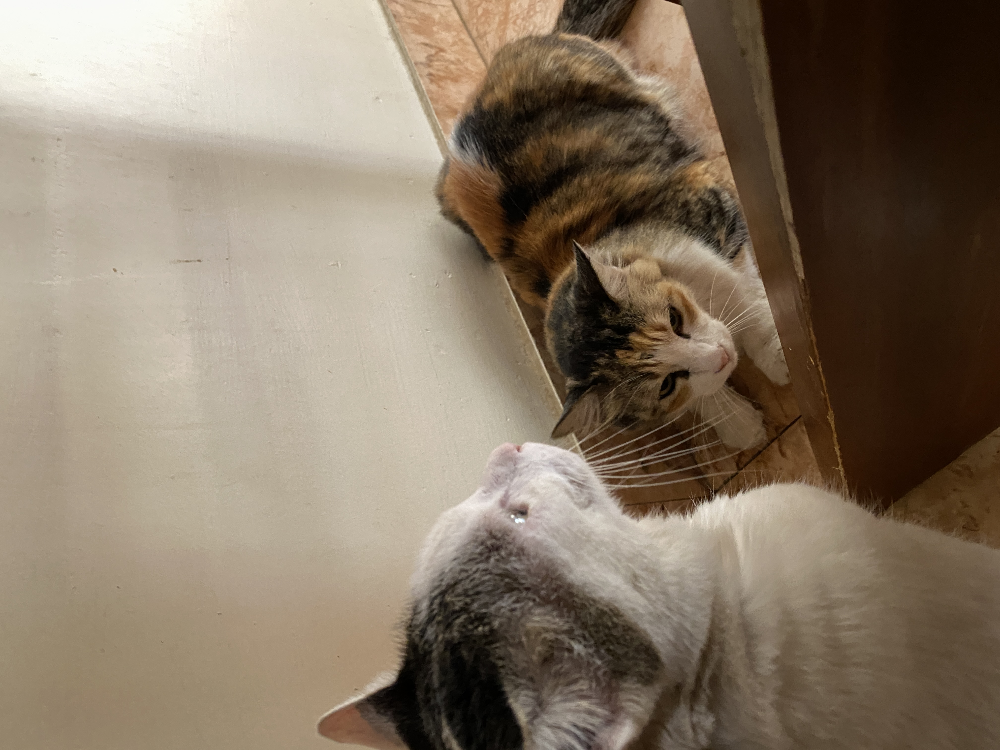

### Hi, I'm Sid 👋

Product marketing manager with 5 years across enterprise IT and B2B SaaS — spanning cybersecurity (remote infrastructure management, incident management, threat mitigation) and workflow automation (HR automation, procure-to-pay, internal approval workflows, legal & contract management). GTM strategy, messaging, positioning, iteration, and demand generation are where I spend most of my time.

I've taken products from 0 to 1, been part of a company rebrand, run demand generation campaigns alongside digital marketing and creative teams that delivered $280K+ in qualified pipeline, and enabled content and creative for PR and social media to drive brand awareness and demand gen. I've also built 150+ pieces of sales enablement collateral in collaboration with enterprise channel partners, creative teams, and design vendors. Increasingly building my workflows with AI - GPT, Claude Code, Replit, HubSpot, Zapier, to name a few - along the way.

Most recently: product marketing at CipherSonic Labs (privacy-first AI infrastructure) and Wepsol, formerly Wipro (cybersecurity & workflow automation SaaS). Babson MBA, Marketing & Business Analytics.

This is where I'm dabbling with — and sharing — marketing skills and prompts for today's AI-native landscape: dashboards, content systems, experiment teardowns, and side projects.

Outside of work: I play keys and sing, produce music, and teach music to kids on the side - played a good number of live shows over the years too. Also into prog metal, cars, and cats.

---

### Currently

- 🛠️ Building [**marketing-skills**](https://github.com/siddarthnandakumar1995/marketing-skills) — a public library of Claude skills, prompts, and workflows for marketers
- 📣 Open to product marketing roles in enterprise IT / B2B SaaS
- 🎹 Producing music and playing keys on the side

---

